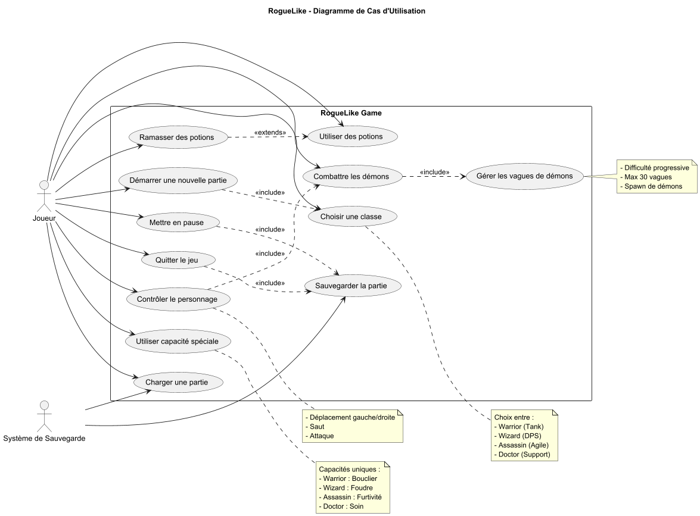
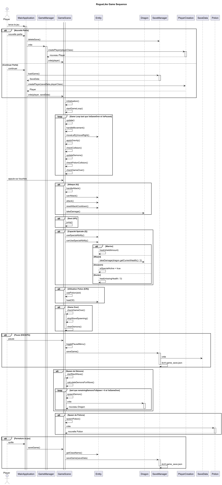
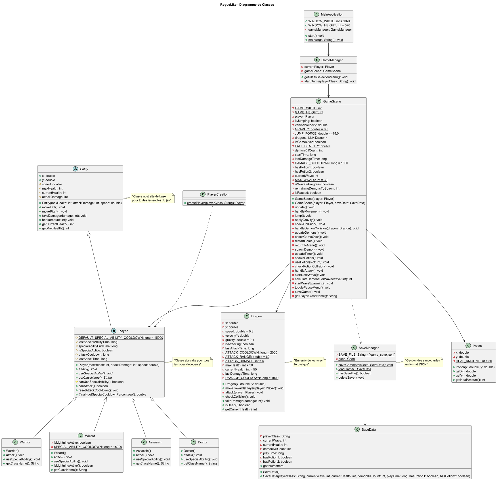
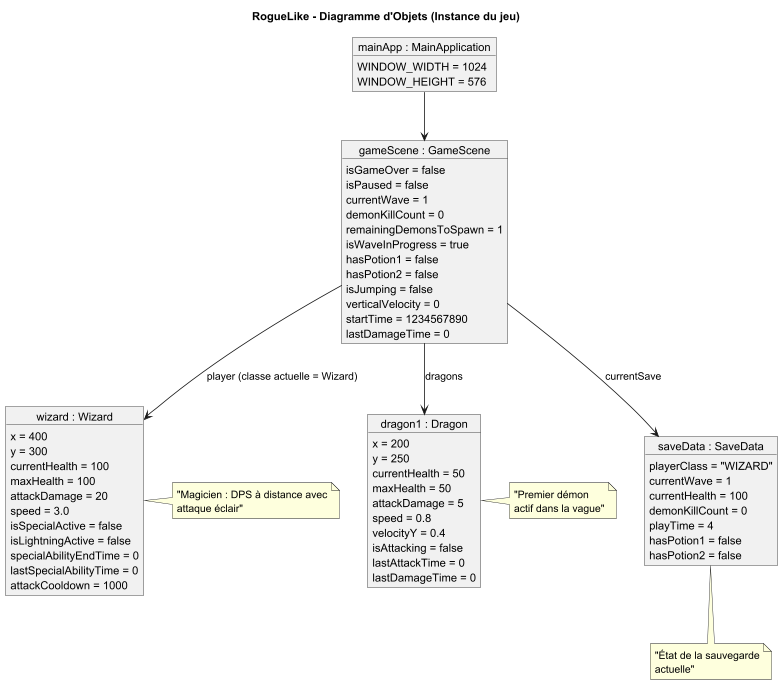

# RogueLike - AM Project

Jeu de plateforme type roguelike développé en Java avec JavaFX, mettant en scène différentes classes de personnages avec des capacités uniques.

## 🎮 Description
RogueLike est un jeu de plateforme où le joueur peut choisir parmi différentes classes de personnages pour affronter des vagues de démons. Chaque classe possède ses propres caractéristiques et capacités spéciales.

## 📁 Structure du projet
Le projet suit une architecture orientée objet avec les packages suivants :
```
com.projet.projet/
├── entities/
│   ├── Player.java         # Classe abstraite de base pour tous les personnages
│   ├── Entity.java         # Classe de base pour toutes les entités du jeu
│   ├── Demon.java         # Classe des ennemis
│   └── Potion.java        # Classe des potions de soin
├── characters/
│   ├── Warrior.java       # Classe du guerrier
│   ├── Assassin.java      # Classe de l'assassin
│   ├── Wizard.java        # Classe du magicien
│   └── Doctor.java        # Classe du docteur
├── ui/
│   ├── MainMenu.java      # Menu principal
│   ├── GameScene.java     # Scène de jeu principale
│   └── GameMenuUI.java    # Interface utilisateur du menu de jeu
└── core/
    ├── GameManager.java   # Gestionnaire principal du jeu
    ├── SaveManager.java   # Gestion des sauvegardes
    └── PlayerFactory.java # Fabrique de personnages
```

## 👥 Classes de personnages
- **Warrior**: Fort et résistant (150 HP, 25 DMG)
  - Capacité spéciale : Bouclier protecteur
- **Assassin**: Rapide et agile (80 HP, 15 DMG)
  - Capacité spéciale : Furtivité
- **Wizard**: Attaques magiques à distance
  - Capacité spéciale : Bouclier magique
- **Doctor**: Support et soins
  - Capacité spéciale : Zone de soin

## ⭐ Fonctionnalités
- Système de vagues de démons progressives
- Système de sauvegarde/chargement
- Inventaire de potions
- Capacités spéciales uniques pour chaque classe
- Système de score basé sur les éliminations
- Menu pause et game over

## 🎯 Comment jouer
- **Touches directionnelles**: Déplacement
- **A**: Attaque
- **E**: Utiliser potion 1
- **R**: Utiliser potion 2
- **ESPACE**: Capacité spéciale
- **ÉCHAP**: Menu pause

## 🔧 Architecture technique
Le jeu utilise plusieurs patterns de conception :
- **Singleton**: Pour le GameManager
- **Factory**: Pour la création des personnages
- **Observer**: Pour les événements de jeu
- **State**: Pour la gestion des états des personnages

### Gestion des collisions
- Système de plateformes traversables et non-traversables
- Détection de collision pour les attaques et les objets
- Système de gravité et de saut

### Système de sauvegarde
- Sauvegarde automatique en quittant
- Format JSON pour les données de sauvegarde
- Conservation des statistiques de jeu

## 🛠️ Dépendances requises
- Java 17 ou supérieur
- JavaFX 17 ou supérieur
- Maven pour la compilation
- GSON pour la gestion des sauvegardes

# 📈 Diagrammes :


## Diagramme de cas d'utilisation :



## Diagramme de séquence :



## Diagramme de classes :



## Diagramme d'objet :


